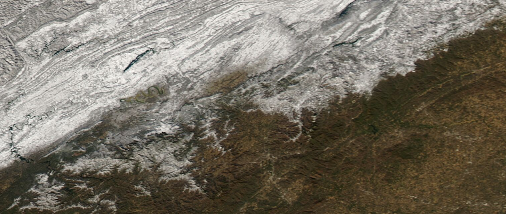
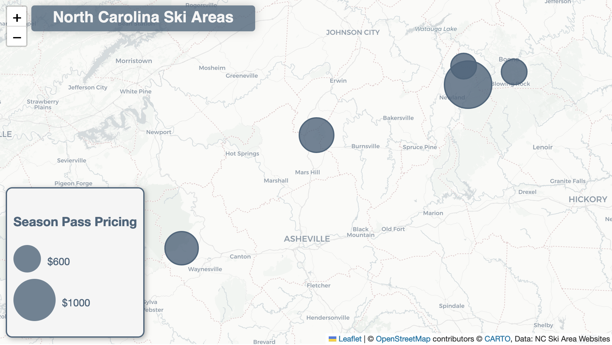
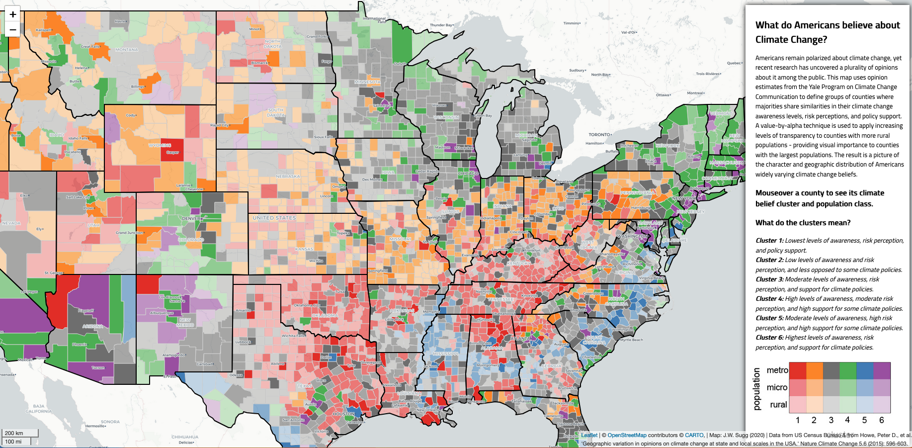
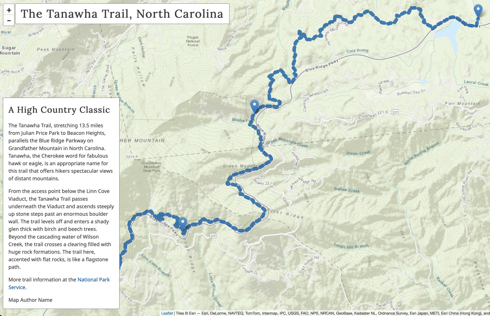
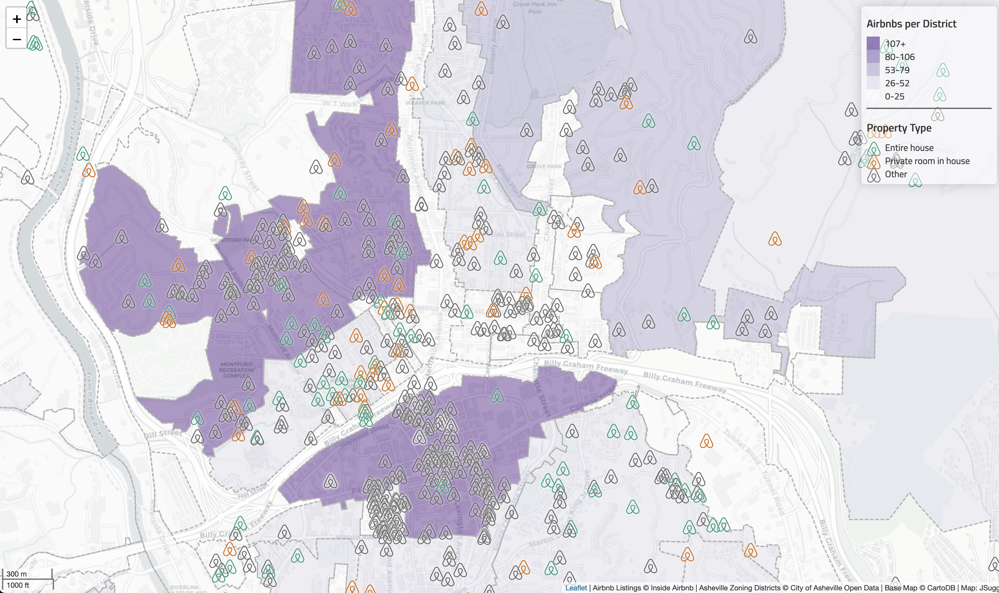
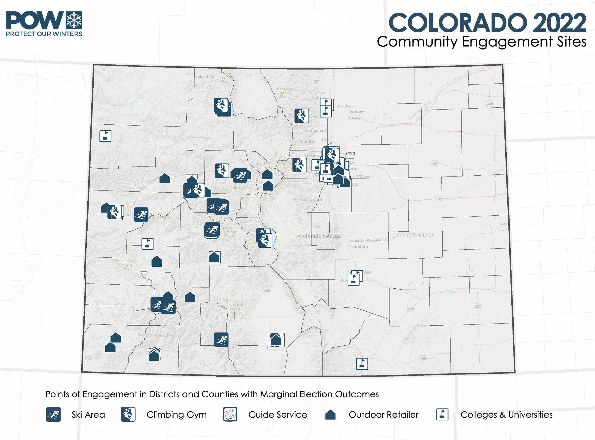
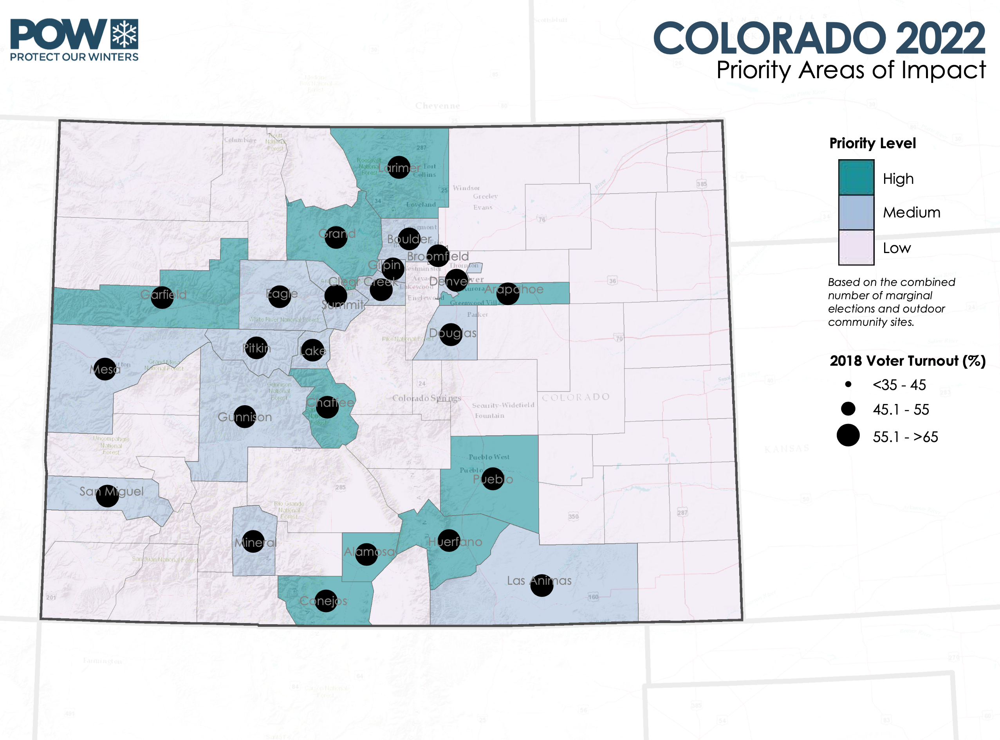
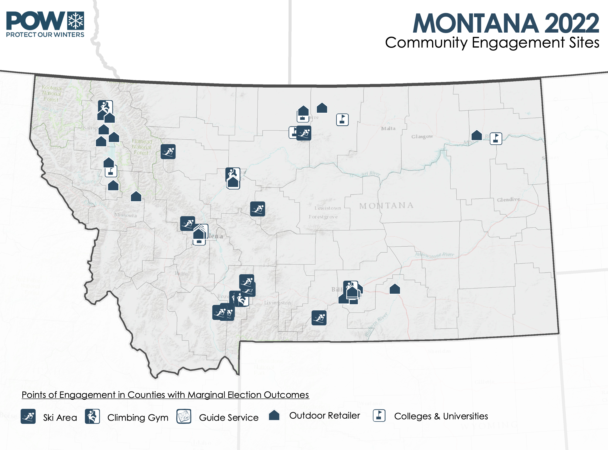
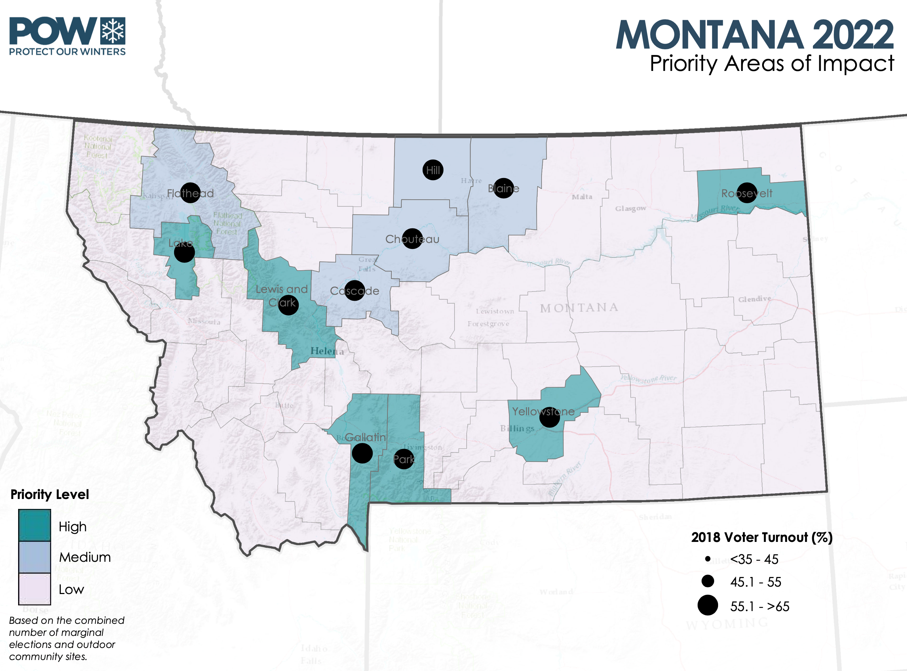

## Johnathan Sugg

I am currently Associate Professor of Geography at Appalachian State University in North Carolina, USA. In addition to my research and teaching in climatology and cartography, I have worked in geospatial tech with experience in static and interactive maps, project management, and GIS application support. I am passionate about user-centered design and finding the right use cases and contexts of geographic information for decision makers. My current work is focused in the areas of cartography and web mapping, climatology, communication and visualization, and human perception.

### Portfolio

### Recent Teaching
- *Cartographic design & analysis*
- *Web mapping*
- *Communicating geographic information*
- *Nature and culture of climate change*

### Recent Research
- UX Study: Exploring second-order climate change beliefs with interactive maps. [*AAG Honolulu Poster*](https://drive.google.com/file/d/1usZJmeLQA7tzjIlPhyokqH66HvG_iyEM/view?usp=sharing) (2024).
- Geographical Insights on the Partisan Polarization of the Acceptance of Human-Caused Climate Change in the US. [*Southeastern Geographer*](https://muse.jhu.edu/article/896304). 2023
- Examining spatiotemporal trends of drought in the conterminous United States using self-organizing maps. [*Physical Geography*](https://www.tandfonline.com/doi/full/10.1080/02723646.2022.2035891) (2022).
- Exploratory geovisualization of the character and distribution of American climate change beliefs. [*Weather, Climate, and Society*](https://journals.ametsoc.org/view/journals/wcas/13/1/WCAS-D-20-0071.1.xml) (2021).
